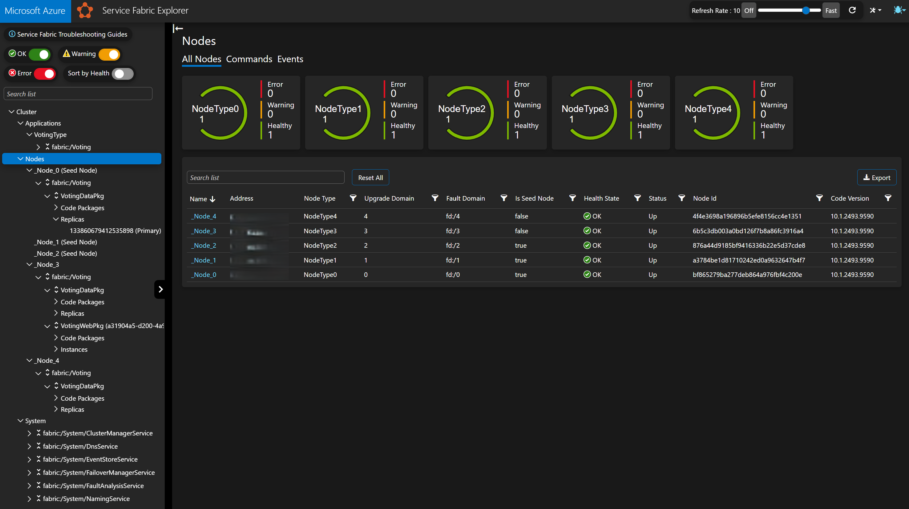
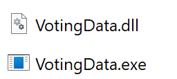
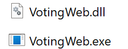

---
languages:
- csharp
products:
- azure
- azure-service-fabric
page_type: sample
description: "The quickstart contains an application with multiple services demonstrating the concepts of service communication and use of reliable dictionaries."
---

# Service Fabric .NET Quickstart
This repository contains an quickstart project for [Microsoft Azure Service Fabric](https://azure.microsoft.com/services/service-fabric/). The quickstart project contains a single application with multiple services demonstrating the basic concepts of service communication and use of reliable dictionaries.

For a guided tour with the quickstart:
[Service Fabric .NET quickstart](https://docs.microsoft.com/en-us/azure/service-fabric/service-fabric-quickstart-dotnet)

More info on Service Fabric:
 - [Documentation](https://docs.microsoft.com/azure/service-fabric/)
 - [Service Fabric sample projects](https://azure.microsoft.com/resources/samples/?service=service-fabric)
 - [Service Fabric open source home repo](https://github.com/azure/service-fabric)

# Note for studying..

### Service Fabric Explorer

- Azure Service Fabric can deploy EXE processes on Windows nodes as part of the services running in the cluster. These EXE processes are managed and orchestrated like any other service in Service Fabric.

    

### Node

- `C:\SfDevCluster\Data\_App\_Node_0\VotingType_App0\VotingDataPkg.Code.1.0.0`

    

- `C:\SfDevCluster\Data\_App\_Node_3\VotingType_App0\VotingWebPkg.Code.1.0.0`

    

### Kubernetes vs Azure Service Fabric: Feature Comparison

- Created the comparison table with ChatGPT, Gemini, and Perplexity

| **Category**               | **Kubernetes (AKS)**                          | **Azure Service Fabric**                      | **Key Differences**                                                                 |
|----------------------------|-----------------------------------------------|------------------------------------------------|-------------------------------------------------------------------------------------|
| **Configuration**          | ConfigMap (key-value files)                   | XML-based Configuration Packages               | ASF supports dynamic config updates without redeploys via `Settings.xml`            |
| **Secrets**                | Secrets (base64-encoded)                      | Native Azure Key Vault Integration             | ASF enables automatic secret rotation via `ManagedKeyVaultReference`                |
| **Networking**             | Ingress Controllers (e.g., AGIC, NGINX)       | Reverse Proxy + Azure Application Gateway      | ASF reverse proxy supports automatic service discovery without DNS                  |
| **State Management**        | StatefulSets + Persistent Volumes             | Reliable Services + Reliable Collections       | ASF stores state in-memory with <3ms latency vs Kubernetes' external storage (~20ms)|
| **Storage**                | PVCs + Azure Disks/Files                      | Ephemeral SSD + Reliable Collections           | ASF provides built-in data replication; Kubernetes requires manual volume setup     |
| **Compute Unit**           | Pod (1+ containers)                           | Service Replica/Instance                       | ASF replicas can run native EXEs alongside containers                                |
| **Cluster State**           | etcd                                          | Fabric Control Plane                           | ASF uses proprietary management system integrated with Azure Monitor/AD             |
| **Upgrades**               | Manual rollouts                               | Automatic Rolling Upgrades                     | ASF enforces upgrade domains for zero-downtime config/secret updates                 |
| **Native Azure Integration**| Requires CSI Drivers                          | Direct Service Fabric Resource Provider        | ASF secrets/certificates appear as first-class ARM resources                        |
| **Windows Support**         | Windows Server 2022 containers only           | Native .NET/Win32 + Windows Containers         | ASF supports legacy .NET 4.x apps in EXE format                                      |

#### Architectural Differences

| **Aspect**                | **Kubernetes**                                | **Azure Service Fabric**                      |
|---------------------------|-----------------------------------------------|------------------------------------------------|
| Stateful Services         | Requires Operators + external storage         | Built-in replicas with in-memory collections   |
| Minimum Node Size         | 2 vCPUs                                       | 3 nodes (5 for production)                     |
| Legacy App Support        | Containerization required                     | Direct EXE deployment                          |
| Service Mesh              | Requires Istio/Linkerd                        | Built-in reverse proxy with TLS termination    |
| Telemetry                 | Prometheus/Grafana                            | Azure Monitor integration out-of-box           |

#### When to Use

| **Scenario**              | **Recommended Platform**                      | **Why?**                                       |
|---------------------------|-----------------------------------------------|------------------------------------------------|
| Cloud-agnostic containers | Kubernetes                                    | Standard API, multi-cloud portability          |
| Low-latency stateful apps | Service Fabric                                | In-memory collections with automatic failover  |
| Windows/.NET migration    | Service Fabric                                | Native EXE support, .NET 4.x compatibility     |
| Hybrid cloud deployments  | Kubernetes                                    | Consistent API across on-prem/cloud            |
| Azure-only microservices  | Service Fabric                                | Tight integration with Key Vault/Event Grid    |

